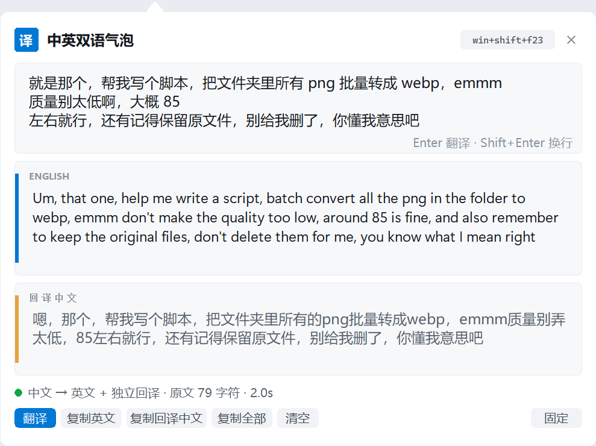
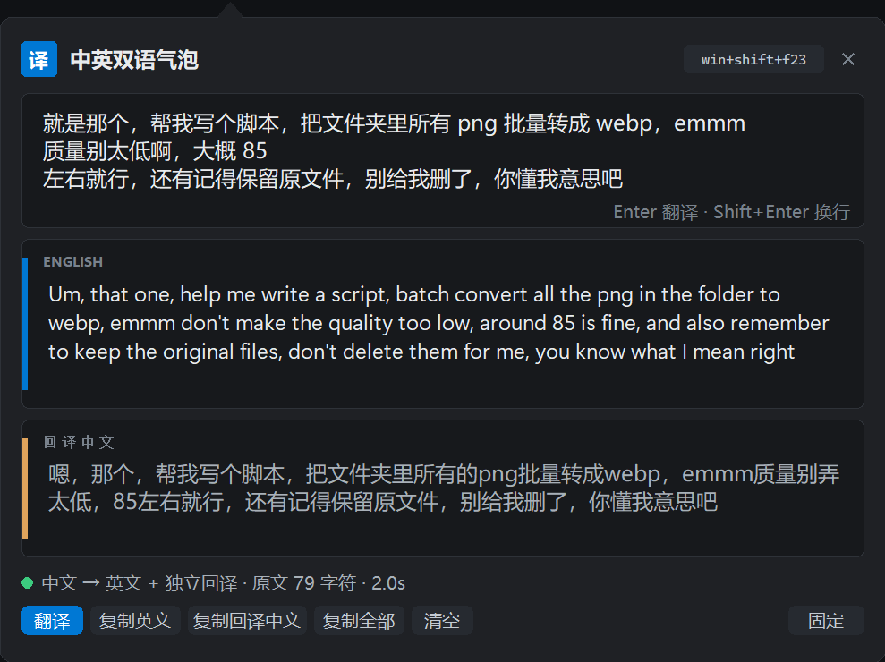

# 中英双语气泡

一个 Windows 小工具：按一下 Copilot 键，把中文提示词翻成英文，再独立地翻回中文，方便你对照检查。英文会自动放进剪贴板。

A Windows hotkey tool that turns Chinese prompts into English, plus an independent back-translation so you can check the result yourself.




## 它做什么

输入中文，会得到两份结果：一份英文，一份把英文再翻回来的中文。回译那一步只看英文、看不到你的原文，所以拿它跟原文一对照，翻译有没有跑偏就很直观。输入英文的话，就只给一份中文。

翻译刻意不做润色。`emmm`、`就是那个`、`你懂我意思吧` 这类语气会原样留下，代码块、JSON、变量名、URL 也保持原样，只翻周围的话。下面是一次真实运行：

```text
就是那个，帮我写个脚本，把文件夹里所有 png 批量转成 webp，emmm 质量别太低啊，
大概 85 左右就行，还有记得保留原文件，别给我删了，你懂我意思吧

Um, that one, help me write a script, batch convert all the png in the folder to webp,
emmm don't make the quality too low, around 85 is fine, and also remember to keep the
original files, don't delete them for me, you know what I mean right

嗯，那个，帮我写个脚本，把文件夹里所有的png批量转成webp，emmm质量别弄太低，
85左右就行，还有记得保留原文件，别给我删了，你懂我意思吧
```

界面是一块无边框的圆角气泡，尖角指向鼠标。触发时只是个小输入条，出结果后往下展开，配色跟着系统深浅色走。鼠标移进去会浮出操作按钮，移开自动收起，需要的话可以点固定。



## 为什么用英文

常有人说，同样的模型用中文问会"降智"。这个感觉不完全是无来由的——Anthropic 的多语言测评里，英文是 100% 基准，简体中文约是它的 96.9%，训练语料里英文占多数也解释了这一点（[arXiv:2404.11553](https://arxiv.org/abs/2404.11553)）。所以对格式要求严的提示词，换英文通常更稳。这个工具，就是给有这个感觉的人准备的。

## 安装和使用

```powershell
git clone https://github.com/M-24rjgc/zh-en-bilingual.git
cd zh-en-bilingual
python translate_popup.py --install-startup   # 开机常驻；也可以直接 python translate_popup.py
```

之后按 Copilot 键就行。

- `Ctrl+Enter` 翻译，`Esc` 关闭
- `Ctrl+1` / `Ctrl+2` 复制英文 / 复制回译中文，`Ctrl+Shift+C` 复制全部
- 鼠标悬停浮出按钮，移开自动收起，可以点固定
- 按住气泡空白处可以拖动

## 配置

都在 `config.json` 里。默认模型是 `deepseek-flash`，接口地址 `https://api.deepseek.com`；`api_key` 留空时会读本机 `~/.codex/config.toml` 里的 token，不复制第二份。

其余常用项：`hotkey`（默认 `win+shift+f23`，也就是 Copilot 键）、`theme`（`auto` / `light` / `dark`）、`accent`（强调色，留空取系统色）、`translucency`（`1.0` 为完全不透明）、`frameless`（输入法候选框异常时改成 `false` 退回标题栏）。

## 其他命令

```powershell
python translate_popup.py --probe          # 按一个键，看它实际发什么键码
python translate_popup.py --once           # 从 stdin 读文本，输出 JSON
python translate_popup.py --selftest       # 离线自测语言判定
python translate_popup.py --snapshot       # 渲染各状态截图（开发用）
python translate_popup.py --uninstall-startup
```

## 说明

- 只支持 Windows，纯 Python 标准库，不用装任何东西。
- 需要一个兼容 OpenAI `chat/completions` 的接口。
- Copilot 键发的是 `Win+Shift+F23`；如果这个组合被系统占用，程序会退到低级键盘钩子把它接管，Copilot 不再弹。
- token 只在运行时从本机配置读取；`logs/translate.log` 只记方向、字符数、耗时和错误，不记内容。

## License

MIT，见 [LICENSE](LICENSE)。
